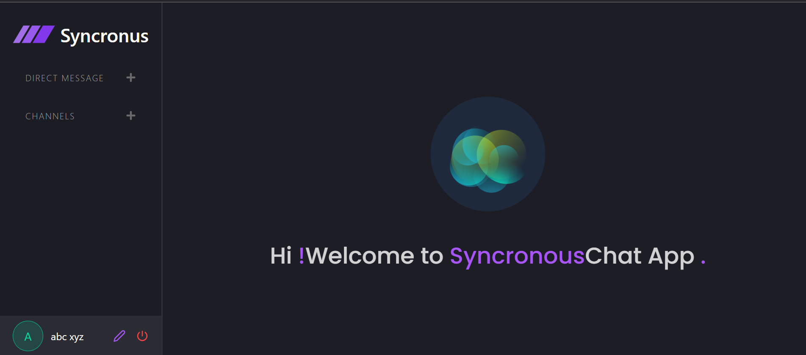

# React Chat app

# Introduction
This project is a real-time chat application built with React and Socket.io. It enables users to communicate instantly by sending and receiving messages in real time. The app supports multiple chat rooms, group messaging, and real-time notifications. The front end is designed with React, providing a responsive and interactive user interface, while Socket.io handles the real-time communication between clients and the server. 

## Tech Stack
This application is built using the following technologies:

- **Frontend**:
  - React.js: A JavaScript library for building user interfaces.
  - React Router: For handling client-side routing.
  - Socket.io-client: For real-time communication between the client and server.
  - Tailwind CSS: A utility-first CSS framework for styling.
  
- **Backend**:
  - Node.js: A JavaScript runtime for building the server-side.
  - Express.js: A web application framework for Node.js.
  - Socket.io: A library for real-time, bidirectional communication between clients and the server.
  
- **Database**:
  - MongoDB: A NoSQL database for storing user and message data (if you're using a database).